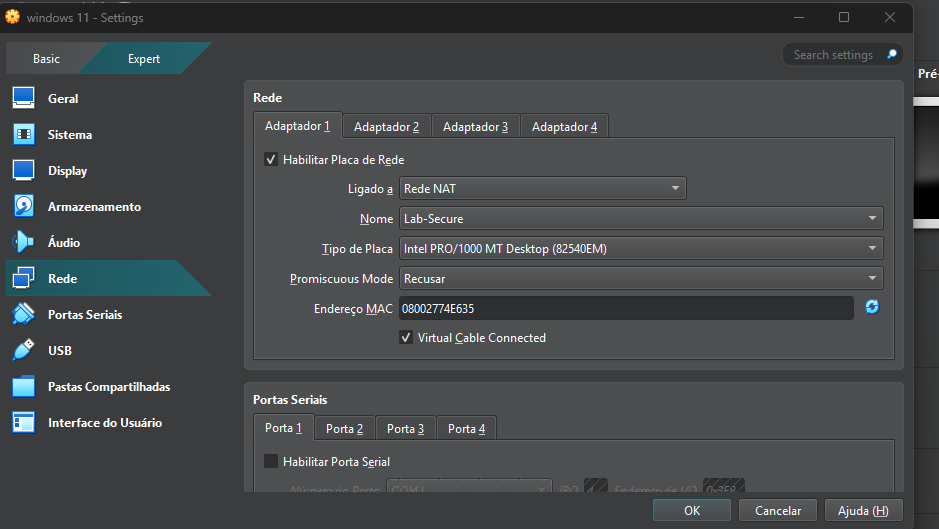

---
[⬅️ Voltar para a Introdução Geral](./README.md)

# 🖥️ Módulo 1: Arquitetura e Montagem do Ambiente de Laboratório

Objetivo: Estabelecer infraestrutura de laboratório segregada via Rede NAT Customizada (Lab-Secure).

Isolamento Lógico: Proteção contra movimentação lateral e prevenção de vazamento de tráfego (port scans/exploits) para a rede física.

Escopo: Ambiente controlado para simulação de ataques (Kali Linux) e coleta de telemetria (Windows + Sysmon).

## 🗺️ Topologia Lógica e Perímetro de Rede

[ VM Atacante: Kali Linux ] ──(Rede NAT: Lab-Secure)──> [ VM Alvo: Windows + Sysmon ]

  
## Lógica da Rede (`Lab-Secure`)
Para garantir que os testes defensivos e os artefatos manipulados não ofereçam riscos ao ambiente de produção ou à minha rede física residencial, configurei um segmento de rede logicamente isolado no VirtualBox.

### 📸 Evidência da Configuração de Rede:
* *

---

## 🔍 Descrição e Funcionamento Técnico do Switch Virtual

O adaptador de rede da máquina virtual foi configurado sob os seguintes critérios de engenharia de segurança:

1. **Modo Ligado a [Rede NAT]:** Diferente do modo NAT padrão (que isola as máquinas entre si), a *Rede NAT* cria um switch virtual interno chamado **`Lab-Secure`**. Isso permite que, no futuro, novas VMs (como um Kali Linux ou um servidor de logs) sejam adicionadas ao laboratório e consigam se comunicar de forma restrita apenas entre si.
2. **Promiscuous Mode [Recusar]:** Configurado estritamente para rejeitar tráfego promiscuo, garantindo que a placa de rede intercepte apenas pacotes direcionados ao seu próprio endereço MAC (`08002774E635`), simulando o comportamento padrão de uma estação de trabalho corporativa.
3. **Isolamento de Vazamento (Leak Protection):** O switch virtual atua como uma barreira de contenção, impedindo que varreduras de portas (port scans), exploits de rede ou requisições maliciosas geradas no laboratório afetem dispositivos físicos reais da minha rede doméstica.

---

